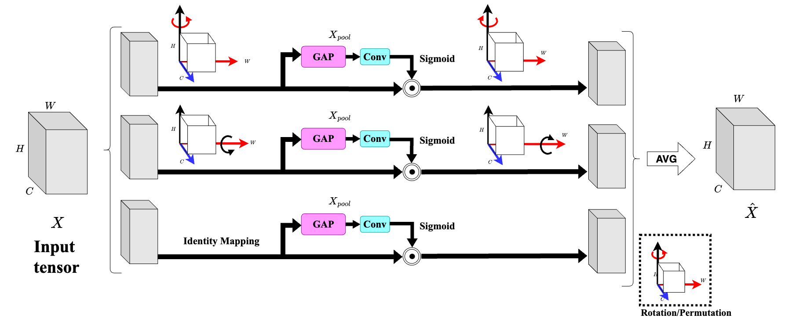

# TRACS 🚀

Official repository for "TRACS: A generalizable Triple Attention Network for
Self-Supervised Coronary Vessel Segmentation"

## Overview 💡

<div align="center">
  
  <p>TRACS Framework Overview</p>
</div>

<div align="center">
  
  <p>Revolving Attention Block (RAB)</p>
</div>


## Abstract 📝

Medical image segmentation is a crucial task that helps reduce radiologists' workload by enabling the accurate assessment of stenosis severity. We present **TRACS**, a self-supervised Triple Attention Network designed to improve multi-scale feature representation for coronary vessel segmentation. The encoder employs parallel convolutions with varying kernel sizes to generate dynamic channel-wise attention weights, thereby effectively capturing fine structural details across different scales. This approach is particularly suited for segmenting thin, elongated structures, such as vessels in angiograms, which are often affected by low contrast and noise. Unlike earlier self-supervised methods that rely on diffusion processes or adversarial learning with multiple generators and discriminators, which often introduce training complexities and optimization instabilities, TRACS adopts a streamlined architecture that ensures stable and consistent convergence. The training process combines L1, clDICE, and BCE losses to optimize both for regional accuracy and boundary precision. We evaluate TRACS on diverse datasets, including unseen coronary angiograms (134XCA and 30XCA) and retinal vessel images (DRIVE and STARE), demonstrating its strong generalization across imaging domains. Results indicate that TRACS outperforms several recent self-supervised methods and matches the performance of supervised baselines in segmentation accuracy and robustness. Additionally, class activation maps (CAM) provide explainability for the model's predictions. TRACS offers a practical, domain-independent solution for structure segmentation tasks in medical imaging.

## Platform and Environment⚙️

*   **OS**: Ubuntu 22
*   **Python**: >= 3.9 
*   **PyTorch**: >= 1.12.1 

## Setup 🛠️
we prefer you to create a conda environment in order to prevent the library mismatch and clashes:

```bash
conda create -n TRACS python=3.9
conda activate TRACS
pip install -r requirements.txt
```

## Data Resources 💾

Datasets utilised in our experiments:

*   **XCAD**: [[Link](https://www.dropbox.com/scl/fi/mvstwdgxo0hfk678x94d4/XCAD.zip?rlkey=qdztml0gzfzoc0t5d16k71u76&e=1&dl=0)]
*   **DRIVE**: [[Link](https://www.kaggle.com/datasets/andrewmvd/drive-digital-retinal-images-for-vessel-extraction)]
*   **CHASEDB1**: [[Link](https://www.kaggle.com/datasets/khoongweihao/chasedb1)]
*   **30 XCA**: [[Link](https://github.com/Binjie-Qin/SVS-net)]
*   **134 XCA**: [[Link](https://www.mdpi.com/2076-3417/9/24/5507)]

## Training 🚀

```bash
python3 main.py -p train -c config/train.json
```

## Testing 🧪

```bash
python3 main.py -p test -c config/test.json
```

## Pre-trained Models 🧠


Pre-trained models for evaluation will be made available soon, we are preparing a self understandable clean codebase for you. 


## 🤝Citation


## Acknowledgements
We acknowledge the use of code from:

*   **NVIDIA SPADE**: [[GitHub](https://github.com/NVlabs/SPADE)]
*   **SSVS (SJTU Shanghai)**: [[GitHub](https://github.com/AISIGSJTU/SSVS)]
*   **C-DARL**: [[GitHub](https://github.com/boahK/MEDIA_CDARL/tree/main)]

We appreciate their contributions to open source.