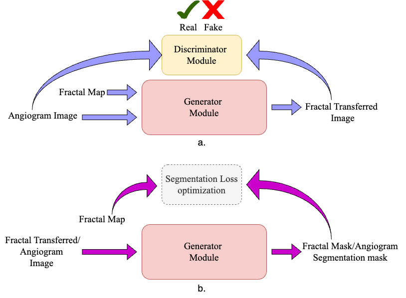
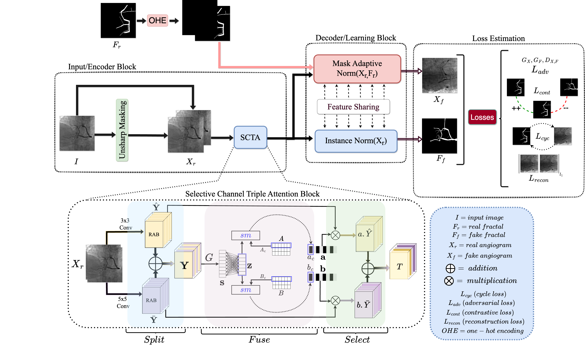
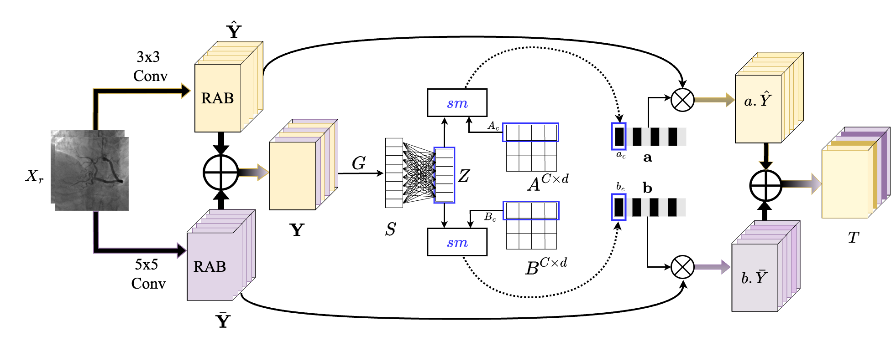

<div align="center">
  
  <p>TRACS Data Flow</p>
</div>

# TRACS 

Official repository for "TRACS: A generalizable Triple Attention Network for
Self-Supervised Coronary Vessel Segmentation"

## Overview 💡

<div align="center">
  
  <p>TRACS Framework Overview</p>
</div>


## Abstract 📝

Medical image segmentation plays a pivotal role in reducing radiologists' workload by enabling accurate severity assessment and treatment planning. With coronary heart disease becoming an increasing concern globally, there is a growing need for efficient and reliable segmentation methods. In this context, we present TRACS, a self-supervised Triple Attention Network designed to enhance multi-scale feature representation for coronary vessel segmentation. The encoder generates dynamic channel-wise attention weights, effectively capturing fine structural details across multiple scales. This design is particularly well-suited for segmenting thin, elongated structures, such as vessels in angiograms, which are often challenging to delineate due to low contrast and occluded vessels. Unlike earlier self-supervised methods that rely on diffusion processes or multi-generator adversarial learning, which often introduce training complexities and optimization instabilities. TRACS adopts a streamlined architecture that not only ensures stable, consistent performance but also operates with a significantly reduced parameter count, making it a lightweight, efficient self-supervised architecture. The training process combines a fusion of losses to optimize both for regional accuracy and boundary precision. We evaluate TRACS on diverse unseen coronary angiograms (134XCA and 30XCA) and retinal vessel images (DRIVE and STARE). \textcolor{blue}{TRACS achieves significant inference gains, in terms of segmentation performance, and inference speed operating up to 3x faster than the nearest baseline method, and a significantly lower memory footprint, making it highly efficient for real-time applications and deployment on resource-constrained devices. We supplement the results with a thorough statistical analysis and explainability results from various Gradient and perturbation-based techniques. Results indicate that TRACS outperforms several recent self-supervised methods and matches the performance of supervised baselines in segmentation accuracy and robustness.} TRACS offers a practical, domain-independent solution for vessel structure segmentation tasks in medical imaging.


<div align="center">
  
  <p>Revolving Attention Block (RAB)</p>
</div>


<div align="center">
  
  <p>Selective Channel Triple Attention (SCTA) Block</p>
</div>

## Platform and Environment⚙️

*   **OS**: Ubuntu 22
*   **Python**: >= 3.8
*   **PyTorch**: >= 1.12.1 

## Setup 🛠️
we prefer you to create a conda environment in order to prevent the library mismatch and clashes:

```bash
conda create -n TRACS python=3.9
conda activate TRACS
pip install -r requirements.txt
```

## Data Resources 💾

Datasets utilised in our experiments:

*   **XCAD**: [[Link](https://www.dropbox.com/scl/fi/mvstwdgxo0hfk678x94d4/XCAD.zip?rlkey=qdztml0gzfzoc0t5d16k71u76&e=1&dl=0)]
*   **DRIVE**: [[Link](https://www.kaggle.com/datasets/andrewmvd/drive-digital-retinal-images-for-vessel-extraction)]
*   **CHASEDB1**: [[Link](https://www.kaggle.com/datasets/khoongweihao/chasedb1)]
*   **30 XCA**: [[Link](https://github.com/Binjie-Qin/SVS-net)]
*   **134 XCA**: [[Link](https://www.mdpi.com/2076-3417/9/24/5507)]

## Training 🚀

```bash
python main.py -p train -c config/train.json
```

## Testing 🧪

```bash
python main.py -p test -c config/test.json
```


## Pre-trained Model


please download the model checkpoints from https://mega.nz/file/5DlE2RQa#PlhGVHh5FlVAKGis__fkY1mcIzvb8H0e3RWCsOFXVXA 
## 🤝Citation


## Acknowledgements
We acknowledge the use of code from:

*   **NVIDIA SPADE**: [[GitHub](https://github.com/NVlabs/SPADE)]
*   **SSVS (SJTU Shanghai)**: [[GitHub](https://github.com/AISIGSJTU/SSVS)]
*   **C-DARL**: [[GitHub](https://github.com/boahK/MEDIA_CDARL/tree/main)]

We appreciate their contributions to open source.